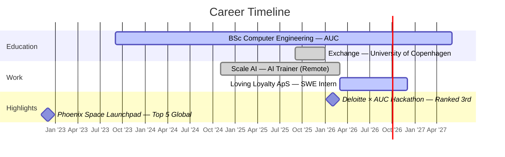

<!-- ════════════════════════════════════════════════════════════════ -->
<!--                       HEADER BANNER                              -->
<!-- ════════════════════════════════════════════════════════════════ -->

<a href="https://github.com/MohamESalem">
  
</a>

<p align="center">
  <a href="https://github.com/MohamESalem">
    
  </a>
</p>

<p align="center">
  <a href="mailto:mohammedelsayedsalem@aucegypt.edu"></a>
  <a href="https://www.linkedin.com/in/mohammed-salem-400468208/"></a>
  <a href="https://github.com/MohamESalem"></a>
  <a href="tel:+201289567817"></a>
</p>

<p align="center">
  
  
  
</p>

<!-- ════════════════════════════════════════════════════════════════ -->
<!--                       ABOUT SECTION                              -->
<!-- ════════════════════════════════════════════════════════════════ -->

##  &nbsp; About Me

```yaml
name:        Mohammed Salem
role:        Software Engineering Intern @ Loving Loyalty ApS 🇩🇰
location:    Cairo, Egypt  →  Copenhagen, Denmark (remote)
education:
  - BSc Computer Engineering, AUC      (GPA 3.7/4.0, Class of 2027)
  - Minor in Mathematics
  - Exchange: University of Copenhagen (Fall 2025 · ML focus)
currently:
  - shipping:    "AI content-generation pipeline (TypeScript + GPT-4o)"
  - learning:    "advanced probabilistic ML"
  - exploring:   "the gap between hardware design and ML systems"
fun_fact:    "I write Verilog and TypeScript in the same week."
```

<br>

<!-- ════════════════════════════════════════════════════════════════ -->
<!--                     STATS DASHBOARD                              -->
<!-- ════════════════════════════════════════════════════════════════ -->

##  &nbsp; GitHub Dashboard

<table align="center" border="0">
<tr border="0">
<td width="50%" valign="top">


</td>
<td width="50%" valign="top">


</td>
</tr>
<tr border="0">
<td colspan="2" align="center">


</td>
</tr>
</table>

<br>


<!-- contribution snake -->
<p align="center">
  <a href="https://github.com/MohamESalem/MohamESalem">
    
  </a>
</p>

<br>


<!-- ════════════════════════════════════════════════════════════════ -->
<!--                       TECH STACK                                 -->
<!-- ════════════════════════════════════════════════════════════════ -->

##  &nbsp; Tech Arsenal

<table align="center">
<tr>
<td valign="top" width="33%" align="center">

#### 💻 Languages

<p>

<br/>

</p>

</td>
<td valign="top" width="33%" align="center">

#### 🌐 Web & Frameworks

<p>

</p>

</td>
<td valign="top" width="33%" align="center">

#### 🤖 ML & Data

<p>

<br/>


</p>

</td>
</tr>
<tr>
<td valign="top" width="33%" align="center">

#### 🛠️ Tools

<p>

</p>

</td>
<td valign="top" width="33%" align="center">

#### ⚙️ Hardware

<p>

<br/>


</p>

</td>
<td valign="top" width="33%" align="center">

#### ☁️ AI/LLM

<p>

<br/>


</p>

</td>
</tr>
</table>

<br>

<!-- ════════════════════════════════════════════════════════════════ -->
<!--                     EXPERIENCE TIMELINE                          -->
<!-- ════════════════════════════════════════════════════════════════ -->

##  &nbsp; Experience Timeline



<br>


<!-- ════════════════════════════════════════════════════════════════ -->
<!--                     ACHIEVEMENTS                                 -->
<!-- ════════════════════════════════════════════════════════════════ -->

##  &nbsp; Achievements

<table align="center">
<tr>
<td align="center" width="50%">

### 🥉 3rd Place
**Deloitte Innovation Hub × AUC Hackathon**
<br><sub><i>February 2026</i></sub>

</td>
<td align="center" width="50%">

### 🚀 Top 5 Global
**Phoenix Space Launchpad Challenge**
<br><sub><i>100+ teams · December 2022</i></sub>

</td>
</tr>
</table>

<br>

<!-- ════════════════════════════════════════════════════════════════ -->
<!--                       FOOTER                                     -->
<!-- ════════════════════════════════════════════════════════════════ -->

##  &nbsp; Let's Connect

<p align="center">
  <em>Open to <b>Summer 2026 software engineering internships</b>.</em><br>
  <em>Especially excited about AI infrastructure, systems work, and developer tools.</em>
</p>

<p align="center">
  <a href="mailto:mohammedelsayedsalem@aucegypt.edu">
    
  </a>
</p>

<br>

<p align="center">
  
</p>

<p align="center">
  <sub>⭐ From <a href="https://github.com/MohamESalem">MohamESalem</a> with caffeine and curiosity ⭐</sub>
</p>
